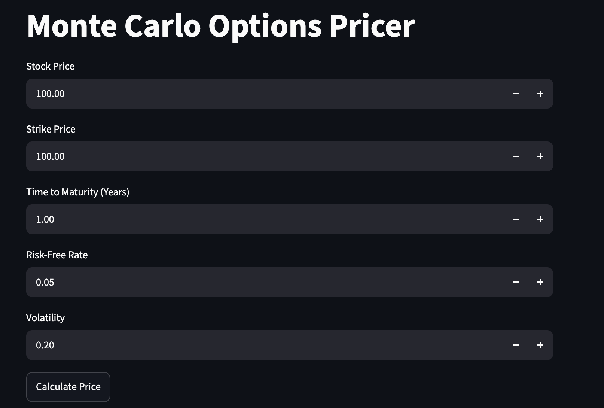

# Monte Carlo Options Pricer

A C++ program that prices a European call option using Monte Carlo simulation, with a Streamlit web interface.

**[Try the live app](https://montecarlo-uw6xdu98psdiriqssygt4y.streamlit.app/)**

## How it works
1. Simulates 100,000 possible terminal stock prices under geometric Brownian motion:

   `S_T = S_0 * exp((r - 0.5 * sigma^2) * T + sigma * sqrt(T) * Z)`

   where `Z` is a standard normal random variable.
2. Calculates the call payoff for each path: `max(S_T - K, 0)`.
3. Averages the payoffs and discounts back to today: `price = exp(-r * T) * average payoff`.

## Inputs
| Parameter | Meaning | Default in app |
|---|---|---|
| `S_0` | Current stock price | 100 |
| `K` | Strike price | 100 |
| `T` | Time to maturity (years) | 1 |
| `r` | Risk-free interest rate | 0.05 |
| `sigma` | Volatility | 0.2 |

## Built with
C++, Python, Streamlit
